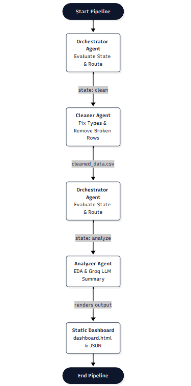
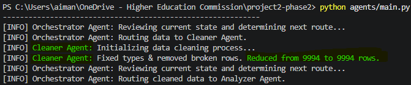
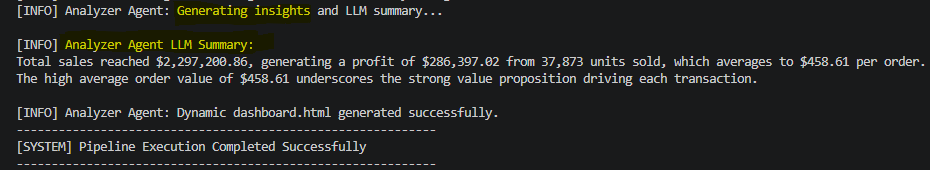
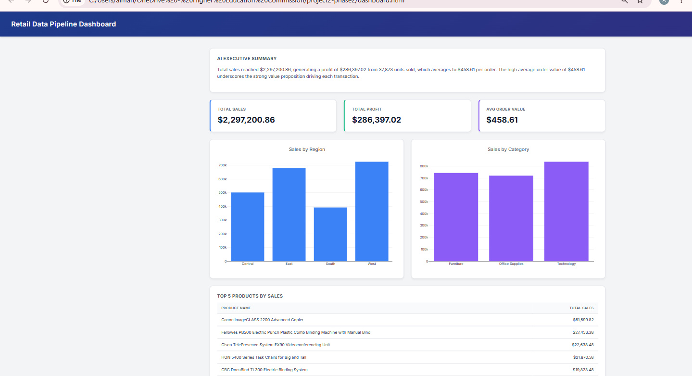

# Case Study: Building a State-Driven Multi-Agent Retail Data Pipeline

## Overview & Project Context
The objective of this project was to implement a functional multi-agent workflow using Python, LangGraph, LangChain, and the Groq API. Rather than handling data processing in a single script, the pipeline delegates tasks to autonomous, specialized agents managed centrally by an orchestrator using a state-driven graph architecture.

---

## Tech Stack & Requirements
- **Python:** Core programming language.
- **LangGraph:** For building the state-driven multi-agent orchestration graph.
- **LangChain:** For message structures and LLM integration wrappers.
- **Groq API:** Free-tier LLM integration (`openai/gpt-oss-20b`) for generating dynamic executive summaries.

---

## 1. The Dataset
I used the Kaggle Superstore Sales dataset for this project. It is a standard retail dataset containing 9,994 rows with the following key attributes:
- **Identifiers & Geography:** Order ID, Customer Name, Region, State, City
- **Product Details:** Category, Sub-Category, Product Name
- **Financial Metrics:** Sales, Quantity, Discount, Profit

This dataset was chosen because it includes real-world formatting inconsistencies and character encoding challenges, making it an effective test case for an automated cleaning and analysis pipeline.

---

## 2. System Architecture & Flow
The system relies on a state machine pattern where the Orchestrator Agent evaluates the current pipeline state and routes data step-by-step.

**Execution Flow:**
Raw Data (.csv) -> Orchestrator -> Cleaner Agent -> Orchestrator -> Analyzer Agent -> Static Dashboard (.html)

*Architecture Flow Diagram:*  


---

## 3. Step-by-Step Implementation

### Step 1: Orchestration & State Management
Handled in `agents/orchestrator.py`. The orchestrator functions as the control center; it inspects the state keys, checks if the data has been cleaned, and decides the next execution route without modifying the data itself.

### Step 2: Automated Data Sanitization (Cleaner Agent)
Handled in `agents/cleaner.py`. This agent handles data friction by resolving windows-1252 encoding errors, enforcing proper numeric types on financial columns (Sales, Profit, Quantity, Discount), removing duplicates, and filtering out invalid rows.

*Terminal Output — Cleaning & Row Count Verification:*  


### Step 3: Analysis & LLM Summarization (Analyzer Agent)
Handled in `agents/analyzer.py`. This agent performs exploratory data analysis calculating total sales, profit, regional distribution, top products, and true Average Order Value using unique Order IDs. It then connects to the Groq API (using the openai/gpt-oss-20b model) via LangChain to generate a concise, grounded executive summary based strictly on the computed numbers.

*Terminal Output — LLM Summary & Pipeline Completion:*  


### Step 4: Dashboard Preview
The pipeline programmatically builds a responsive HTML dashboard (`dashboard.html`) embedded with Plotly charts, key metric cards, the AI summary, and a top products table.

*Rendered Dashboard Preview:*  


---

## 4. Project Structure
```text
project2-phase2/
├── agents/
│   ├── cleaner.py
│   ├── main.py
│   ├── orchestrator.py
│   └── analyzer.py
├── assets/
│   ├── analysis_insights.json
│   ├── analysis-output.png
│   ├── cleaning-result.png
│   ├── dashboard-preview.png
│   └── flow-diagram.png
├── data/
│   └── cleaned_data.csv
├── dashboard.html
├── requirements.txt
└── README.md
