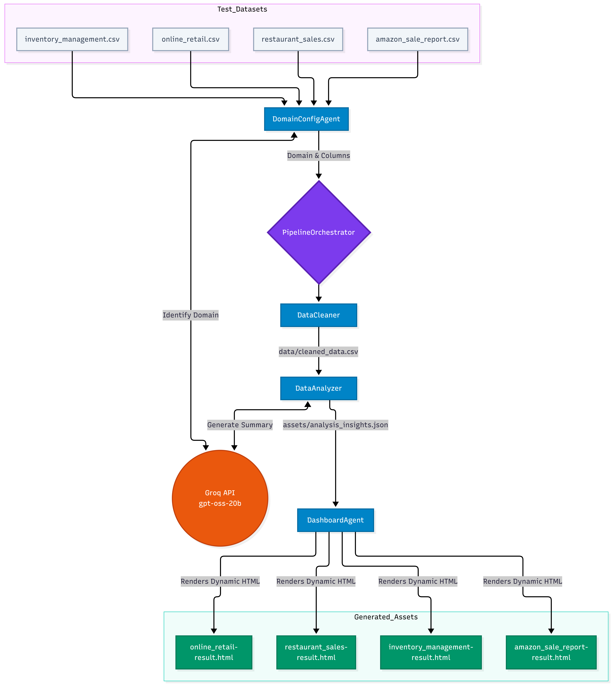

# Phase 3: Dynamic Multi-Agent Production Pipeline

## Project Overview
This multi-agent system utilizes LangGraph and the Groq API to dynamically process, analyze, and visualize data across multiple business domains. The pipeline adapts its metrics automatically without hardcoded rules.

## Architecture & Flow Diagram
1. **DomainConfigAgent:** Analyzes dataset columns and file context to identify the business domain.
2. **PipelineOrchestrator:** Routes the execution path and manages state variables.
3. **DataCleaner:** Prevents malformed data crashes gracefully.
4. **DataAnalyzer:** Discovers metrics dynamically based on column structures.
5. **DashboardAgent:** Renders domain-specific HTML visualization dashboards.



## Pipeline Execution Log
Below is the actual terminal output demonstrating the multi-agent orchestration dynamically processing different domains:

```text
[SYSTEM] Starting process for test-datasets/online_retail.csv
[INFO] Domain Config Agent: Inspecting test-datasets/online_retail.csv
[INFO] Domain Identified: E-commerce Sales
[INFO] Orchestrator: Starting pipeline for E-commerce Sales domain.
[INFO] Cleaner Agent: Sanitizing data...
[INFO] Cleaner Agent: Cleaned 1000 rows.
[INFO] Analyzer Agent: Generating insights...
[INFO] Analyzer Agent: Analysis completed.
[INFO] Dashboard Agent: Rendering dynamic HTML...
[INFO] Dashboard Agent: Created assets/online_retail-result.html
------------------------------------------------------------
------------------------------------------------------------
[SYSTEM] Starting process for test-datasets/restaurant_sales.csv
[INFO] Domain Config Agent: Inspecting test-datasets/restaurant_sales.csv
[INFO] Domain Identified: Restaurant Sales
[INFO] Orchestrator: Starting pipeline for Restaurant Sales domain.
[INFO] Cleaner Agent: Sanitizing data...
[INFO] Cleaner Agent: Cleaned 254 rows.
[INFO] Analyzer Agent: Generating insights...
[INFO] Analyzer Agent: Analysis completed.
[INFO] Dashboard Agent: Rendering dynamic HTML...
[INFO] Dashboard Agent: Created assets/restaurant_sales-result.html
------------------------------------------------------------
------------------------------------------------------------
[SYSTEM] Starting process for test-datasets/inventory_management.csv
[INFO] Domain Config Agent: Inspecting test-datasets/inventory_management.csv
[INFO] Domain Identified: Inventory Management
[INFO] Orchestrator: Starting pipeline for Inventory Management domain.
[INFO] Cleaner Agent: Sanitizing data...
[INFO] Cleaner Agent: Cleaned 400 rows.
[INFO] Analyzer Agent: Generating insights...
[INFO] Analyzer Agent: Analysis completed.
[INFO] Dashboard Agent: Rendering dynamic HTML...
[INFO] Dashboard Agent: Created assets/inventory_management-result.html
------------------------------------------------------------
------------------------------------------------------------
[SYSTEM] Starting process for test-datasets/amazon_sale_report.csv
[INFO] Domain Config Agent: Inspecting test-datasets/amazon_sale_report.csv
[INFO] Domain Identified: E-commerce Sales
[INFO] Orchestrator: Starting pipeline for E-commerce Sales domain.
[INFO] Cleaner Agent: Sanitizing data...
[INFO] Cleaner Agent: Cleaned 2095 rows.
[INFO] Analyzer Agent: Generating insights...
[INFO] Analyzer Agent: Analysis completed.
[INFO] Dashboard Agent: Rendering dynamic HTML...
[INFO] Dashboard Agent: Created assets/amazon_sale_report-result.html
